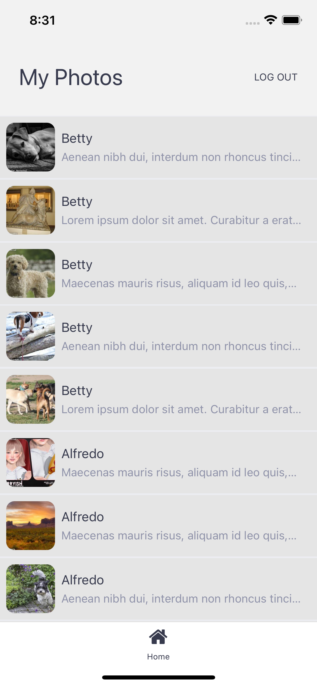

<h1>Login Challenge for MANIAK<h1>

This is a React Native Application for both Android and iOS, that consumes APIs and output the result.

### `Instructions to run the App`

- Open a new Terminal window
- Clon the repository with command "git clone https://gitlab.com/antoniomefa/maniak-login.git"
- Enter to the project folder "maniak-login"
- Run "npm install" command for install all the dependencies
- Run "npx react-native run-android" command for run the Android App
- Run "npx react-native run-ios" command for run the iOS App
- Use the test username: "challenge@maniak.co" and password: "maniak2020" to log in

### `Description`

- The application has two screens: login and home.
- Developed with bare React Native
- Apply ES6 standards
- Use only functional components
- Use Redux for the state management
- Use React-Navigation with conditional rendering
- The app comunicate with an API to get some photos and info to display
- Use AsyncStorage for persist session information between application launches

Login screen

Home screen

By: Antonio Mendiola Farías - 2021
